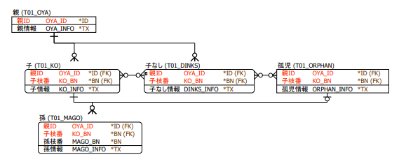
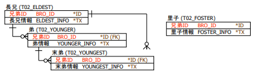
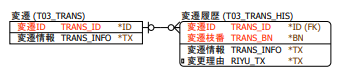
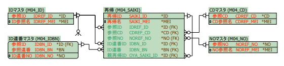
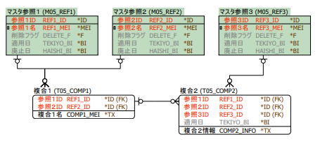
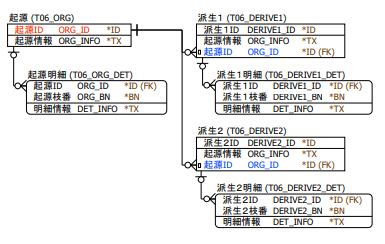
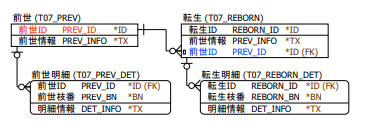
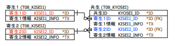

# DB Design Guideline

**主キーおよび外部キーからテーブル間の関連情報を取得し、  
Entity・Validator・Action・HTMLなどWebアプリケーションに必要なファイルを出力します。**

---

## 主キー同士の関連

### １．親子パターン

主キー構成の一致関係により、テーブル間の親子関係を判定する。

- **親モデル**  
  主キーが先頭から一致し、かつ主キー数が一つだけ多いテーブルが存在する。

- **子モデル**  
  最終キー以前まで主キーが一致するテーブルが存在する。

### （親子パターン例外）

- **子なしモデル**  
  子モデルを設定しないテーブル。

- **孤児モデル**  
  親モデルを設定しないテーブル。

### ２．兄弟パターン

同一の主キー構成を持つテーブル間の関係を定義する。

- **兄弟モデル**  
  同一の主キーを持つテーブル。

### （兄弟パターン例外）

- **長兄モデル**  
  他のテーブルの兄弟として設定されないテーブル。

- **末弟モデル**  
  他のテーブルを兄弟として設定しないテーブル。

- **里子モデル**  
  兄弟関係の評価対象外とするテーブル。

### ３．履歴パターン

親子パターンを拡張し、履歴管理用テーブルを判定する。

- **履歴モデル**  
  - 親子パターンに該当する
  - 最終キーが連番キーで、変更理由カラムの有無に関わらず全項目が一致する  
  - 履歴元テーブル名が履歴テーブル名に前方一致する

---

## マスタ参照の関連

### ４．参照パターン

参照パターンは、マスタテーブルとそれを参照するテーブル間の  
参照関係を表す。

- **参照モデル**  
  - 「キー接尾辞：項目名接尾辞」の設定に該当する主キーおよび列名が存在すること
  - 他のテーブルが、当該主キーを外部キーとして参照していること

- **再帰モデル**  
  自テーブルの主キーを外部キーとして参照しているテーブル。  
  この場合、参照関係は再帰的に評価される。

### ５．複合パターン

複合パターンは、複数の参照関係を持つテーブルについて  
参照先を一意に決定するためのパターンである。

- **複合モデル**  
  - 参照パターンに該当する  
  - 二つ以上のテーブルについて、主キーを参照している
  - 複合モデルにおいては参照モデルのうち **主キーの一致数が最大となるテーブル** を参照先モデルとして採用する。

---

## 必須外部キーでの関連

### ６．派生パターン

派生パターンは、共通の必須外部キーを持つ複数テーブルから  
派生関係を判定するためのパターンである。

- **派生モデル**  
  同一の必須外部キーを持つテーブルが複数存在する場合、それらのテーブルを派生モデルとする。

- **起源モデル**  
  当該テーブルの主キーを、必須項目として参照するテーブルが複数存在するテーブル。

### ７．転生パターン

転生パターンは、必須外部キーによって  
一対一の強い依存関係を持つテーブルを判定するためのパターンである。

- **転生モデル**  
  外部キーが必須項目であり、かつ参照先テーブルが一つのみであるテーブル。

- **前世モデル**  
  当該テーブルの主キーを、必須項目として参照するテーブルが一つのみ存在するテーブル。

### ８．共生パターン

共生パターンは、複数の必須外部キーによって  
強く結合されたテーブル関係を判定するためのパターンである。

- **共生モデル**  
  テーブル内に、必須の外部キーが複数存在するテーブル。

- **寄生モデル**  
  - 主キーが、必須外部キーとして他のテーブルから参照されている  
  - その参照元テーブル内に、必須の外部キーが複数存在する

---

## 任意外部キーでの関連

### ９．集約パターン

集約パターンは、任意外部キーによって  
テーブル群を論理的に集約する関係を判定するためのパターンである。

- **集約モデル**  
  - 当該テーブルの主キーを、任意外部キーとして参照するテーブルが存在する  
  - その参照元テーブルが、他に任意外部キーでの参照先を持たない

- **集団モデル**  
  任意外部キーによるテーブル参照が、一つのテーブルにのみ存在するテーブル。

### （集約パターン例外）

他生パターンは、集約パターンに該当し得る参照関係であっても、  
他の強い関係（転生パターン等）が存在する場合に  
集約対象から除外するための補助パターンである。

- **他生モデル**  
  - 任意の外部キーを持ち、参照先が集約モデルとなり得るが、その参照先が他のテーブルの転生先である場合  
  - 任意の外部キーを持ち、参照先が集約モデルとなり得るが、自テーブルが他のテーブルの転生元である場合

### １０．選抜パターン

選抜パターンは、複数の任意外部キーから  
参照先を選択する関係を判定するためのパターンである。

- **選抜モデル**  
  テーブル内に、任意の外部キーが複数存在するテーブル。

- **候補モデル**  
  - 当該テーブルの主キーを、任意外部キーとして参照するテーブルが存在する  
  - その参照元テーブル内に、任意の外部キーが複数存在する

---

## １１．VIEWによる動的な関連

本章では、**VIEW（ビュー）** を用いて定義される  
物理テーブルに依存しない **動的なテーブル関連** について、  
参照構造および役割に基づくモデル関係パターンを定義する。

VIEW は、物理的な外部キー制約を持たない場合が多いため、  
本章の定義は **論理的な関連判定** を目的とする。

- **変換ビュー**  
  変換元となるテーブルを、変換先のテーブル定義に合わせて参照する VIEW。  
  参照対象のテーブル名を明示的に指定する。

- **振分ビュー**  
  複数のテーブルを組み合わせて参照し、行単位で参照先テーブル名を切り替える VIEW。  
  主に単票起動や動的遷移の振り分けに用いられる。
